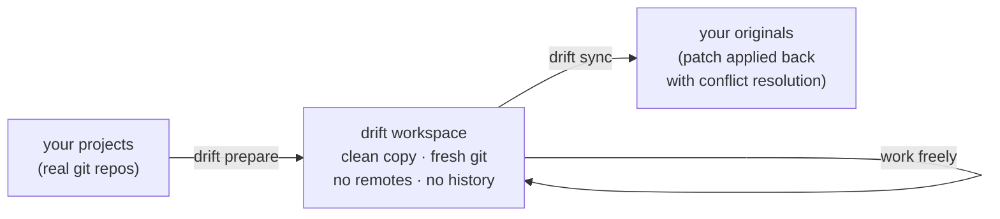
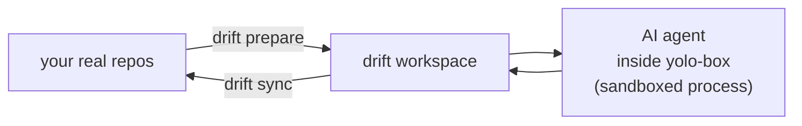

# Drift — isolated workspace manager with sync-back

> Clone your projects into a clean, no-history, no-remotes workspace. Work freely. Patch the results back.

---

## The problem

You want to run a big refactor, let an AI agent loose, or experiment across multiple repos at once — but you don't want to pollute your git history, risk an accidental push, or spend ten minutes wiring up worktrees for every session.

**Drift solves this in one command.**

`drift prepare` copies your projects into a fresh, self-contained workspace with a clean git repo, no remotes, and zero history baggage. Do whatever you want in there — commit freely, break things, rebuild them. When you're happy, `drift sync` generates a patch and applies it back to your originals with full 3-way merge conflict resolution.



---

## Use cases

Drift was born from AI workflows, but it's useful any time you want a clean scratch space that patches back cleanly:

| Use case | Why Drift helps |
|---|---|
| **AI agent sessions** | Give the AI a history-free repo it can commit to freely — no risk of pushing to your remotes, no noise in your history |
| **Risky refactors** | Experiment with big structural changes without creating throwaway branches you'll have to clean up |
| **Multi-repo composition** | Pull `api` + `frontend` + `shared-lib` into one workspace and refactor across all of them at once |
| **Dependency upgrades** | Upgrade a major dep across several repos in isolation, verify everything works, then patch back |
| **Pair/teaching sessions** | Hand someone a clean copy of the codebase — no git credentials, no accidental pushes, nothing to untangle afterwards |
| **Code archaeology** | Annotate, restructure, and explore a codebase freely without leaving traces in the real repo |

---

## Pairs well with AI sandboxes

Drift handles the *code* side of isolation — clean workspace, no remotes, structured sync-back. For the *process* side (no internet access, no shell escapes, resource limits), pair it with an AI execution sandbox like **[yolo-box](https://github.com/nicholasgasior/yolo-box)**.

The combination covers both layers:



- **yolo-box** (or similar) constrains *what the AI process can do* — network, filesystem scope, resource usage
- **Drift** constrains *what the AI can affect in your git history* — no remotes, no shared history, clean patch back

Neither tool alone gives you the full picture. Together they let you run an AI agent with genuine freedom and genuine safety.

---


Worktrees are great for switching between branches in the *same* repo. Drift is for when you want to truly step away from it:

| | Drift | git worktree |
|---|---|---|
| Shared git history | ✗ none — clean slate | ✓ same repo |
| Remotes (accidental push risk) | ✗ no remotes at all | ✓ same remotes |
| Span multiple repos | ✓ yes, in one workspace | ✗ one repo only |
| History-free context for AI | ✓ yes | ✗ carries everything |
| Sync back to originals | ✓ patch-based, with conflict resolution | manual |

The short version: a worktree is still *linked* to your real repo. Drift gives you a completely unlinked, composable copy with a structured path back.

---

## Install

```bash
git clone <repo-url> ~/Code/drift
cd ~/Code/drift
bash install.sh
```

`install.sh` will:
- Symlink `bin/drift` → `~/.local/bin/drift`
- Create `~/.local/share/drift/workspaces/` (workspace storage)
- Write `~/.config/drift/config` (source dir pointer for upgrades)
- Print PATH instructions if `~/.local/bin` is not on your PATH yet

---

## Quick start

```bash
# 1. Create a workspace from one or more project directories
drift prepare my-session ~/projects/api ~/projects/frontend

# 2. Go work in it (or point your AI agent at it)
cd ~/.local/share/drift/workspaces/my-session

# 3. When done, sync changes back to your originals
drift sync my-session --3way
```

That's it.

---

## Commands

### `drift prepare`

```bash
drift prepare <name> <folder> [folder2 ...]
```

Copies the given directories into a new workspace, strips all git history, and creates a fresh git repo with an initial commit.

```bash
# Single project
drift prepare api-refactor ~/projects/api

# Multiple projects composed into one workspace
drift prepare full-stack ~/projects/api ~/projects/frontend ~/projects/shared
```

Result:
```
~/.local/share/drift/workspaces/full-stack/
  api/        ← copied, no git history
  frontend/   ← copied, no git history
  shared/     ← copied, no git history
  .git/       ← fresh, no remotes
```

### `drift sync`

```bash
drift sync <workspace> [--3way|--reject] [--dry-run|--patch] [--force]
```

Generates a diff between the workspace and each original source directory, then applies it back. See [Sync modes](#sync-modes) below.

You can pass either the workspace name or its full path.

### `drift list`

```bash
drift list
```

Lists all workspaces with their creation timestamps.

### `drift status`

```bash
drift status <workspace>
```

Shows workspace details: source projects, git branch, commit count, and working tree state.

### `drift delete`

```bash
drift delete <workspace> [--force]
```

Deletes the workspace directory and its meta file. Warns about unsynced commits before prompting for confirmation.

### `drift upgrade`

```bash
drift upgrade
```

Runs `git pull` in the cloned repo and re-checks the symlink.

---

## Sync modes

When syncing back, you choose how conflicts are handled:

| Flag | Behaviour | Use when |
|---|---|---|
| `--3way` | `git apply --3way` — failed hunks become `<<<<`/`====`/`>>>>` conflict markers | Your original is a git repo and you want standard merge-style resolution |
| `--reject` | `git apply --reject` — failed hunks saved to `<file>.rej` | The original isn't a git repo, or you prefer to fix hunks manually |
| `--dry-run` | Preview only — shows stats, modifies nothing | Before committing to an apply |
| `--patch` | Prints the raw diff to stdout | Inspect the diff or pipe it into another tool |

`--3way` creates a `drift/<workspace-name>` safety branch in the original repo before applying, so you can always reset if something goes wrong.

---

## Configuration

| Variable | Default | Description |
|---|---|---|
| `DRIFT_WORKSPACES_DIR` | `~/.local/share/drift/workspaces` | Root directory for all workspaces |

Set it in your shell or prefix individual commands:

```bash
export DRIFT_WORKSPACES_DIR=~/scratch/drift-workspaces
drift prepare my-task ~/projects/api
```

---

## Requirements

- bash 4+
- git

---

## How it works

See [INTERNALS.md](INTERNALS.md) for a step-by-step walkthrough of what each command does under the hood.

**Safety guarantees:**
- Refuses to overwrite an existing workspace
- Workspace names are restricted to alphanumeric, hyphens, and underscores — no path traversal
- Source dirs that are `/` or an ancestor of the workspaces directory are rejected
- All `.git` directories *and* `.git` files (worktree pointers) are stripped recursively from copies

---

## Contributing

Contributions welcome. The codebase is plain bash — `set -euo pipefail` throughout, shellcheck-clean. Open an issue to discuss bigger changes before starting.

---

## License

MIT
